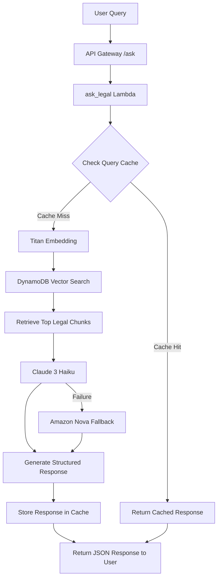

# PYTHon-AI-for-Bharat
# Legal AI Assistant for Bharat

<p align="center">


</p>

---

# Overview

Legal AI Assistant for Bharat is an AI-powered legal awareness platform designed to help citizens understand their legal rights and procedures in simple language.

The system uses Retrieval-Augmented Generation (RAG) to retrieve relevant legal information from a curated knowledge base and then uses large language models to convert complex legal text into understandable explanations.

The platform is built using a scalable AWS serverless architecture that ensures reliability, efficiency, and low operational cost.

Unlike traditional AI systems that generate answers directly, this system retrieves legal context first and then asks the AI model to explain it. This significantly reduces hallucinations and increases trust in the responses.

---

# Problem Statement

Legal information is often difficult for citizens to access and understand due to:

• Complex legal language  
• Large and fragmented legal documents  
• Lack of contextual explanations  
• Difficulty identifying correct legal authorities  

Most online search results simply show raw legal text which is difficult for non-experts to interpret.

---

# Solution

This system introduces an AI-assisted legal awareness platform.

The backend:

1. Retrieves relevant legal sections from a curated dataset
2. Uses AI models to explain those sections in simple language
3. Produces structured responses that guide users on rights and actions

The retrieval-first architecture ensures responses remain grounded in actual legal sources.

---

# System Architecture

The backend follows a retrieval-augmented serverless architecture.



---

# Technology Stack

## Core Technologies

<p>


</p>

• Python  
• AWS Serverless Architecture  

---

## AWS Infrastructure

<p>


</p>

| Service | Role |
|------|------|
| Amazon S3 | Stores legal dataset |
| AWS Lambda | Backend serverless compute |
| DynamoDB | Vector storage and cache |
| API Gateway | Public REST API |
| AWS Amplify | Frontend hosting |
| CloudWatch | Logs and monitoring |

---

# AI and Machine Learning Stack

<p>


</p>

Primary generation model  
Anthropic Claude 3 Haiku

Fallback model  
Amazon Nova

Embedding model  
Amazon Titan Text Embeddings

---

# Backend Summary

The backend is a retrieval-augmented legal awareness system deployed on AWS.

When a user submits a question, the system retrieves the most relevant legal sections from the knowledge base before asking the AI model to generate an explanation.

This ensures that responses remain grounded in real legal text.

The backend integrates:

Amazon Bedrock for model access  
AWS Lambda for serverless compute  
Amazon S3 for dataset storage  
DynamoDB for vector search and caching  
API Gateway for API exposure  

---

# Backend Workflow

## Legal Knowledge Base

The system uses a curated legal dataset stored as:

processed_chunks.json

This dataset contains categorized legal sections such as:

• cybercrime  
• fraud  
• consumer protection  
• women safety laws  
• public safety regulations  

---

## Embedding Generation

A dedicated Lambda function called **embed_loader** generates embeddings.

Steps performed:

1. Load legal chunks from S3
2. Generate embeddings using Amazon Titan
3. Store vectors and metadata in DynamoDB

This process runs only once to avoid repeated computation.

---

## Query Processing

When a request reaches the /ask endpoint:

1. The backend checks if the query exists in cache
2. If cached, the stored response is returned instantly
3. If not cached, the query embedding is generated
4. Vector similarity search retrieves relevant legal chunks
5. Retrieved context is passed to the LLM

---

## AI Explanation

The language model receives strict instructions:

• use only retrieved legal context  
• do not invent external facts  
• produce structured JSON output  

The response includes:

• legal rights  
• recommended actions  
• responsible authorities  
• cited article  
• disclaimer  

---

## Query Cache

After generating the response, the system stores it in DynamoDB.

Future identical queries are served directly from cache which:

• reduces Bedrock cost  
• improves response speed  
• increases scalability  

---

# Key Backend Features

Retrieval-first architecture  
The system retrieves legal sources before AI explanation.

One-time embeddings  
Embeddings are generated once and reused.

Semantic search  
Embedding similarity enables meaning-based search.

Query caching  
Repeated queries are served instantly.

Fallback reliability  
Automatic switch from Claude to Nova if needed.

Structured output  
Clean JSON responses for frontend rendering.

Source transparency  
Responses include referenced legal sources.

---

# Project Structure

```
legal-ai-assistant/
│
├── backend/
│   ├── embed_loader/
│   │   └── lambda_function.py
│   ├── ask_legal/
│   │   └── lambda_function.py
│   └── requirements.txt
│
├── data/
│   └── processed_chunks.json
│
├── frontend/
│
├── docs/
│   ├── architecture.png
│   └── demo_script.md
│
├── README.md
└── deploy_steps.md
```

---

# Deployment Steps

1 Clone the repository  

2 Upload the legal dataset to Amazon S3  

3 Run the embed_loader Lambda function to generate embeddings  

4 Deploy the ask_legal Lambda function  

5 Configure the API Gateway /ask endpoint  

6 Deploy frontend using AWS Amplify  

---

# Future Improvements

• multilingual legal assistance  
• conversational AI interface  
• expanded legal dataset coverage  
• real-time legal updates  
• improved legal citation transparency  

---

# License

This project was developed for educational and hackathon purposes.
