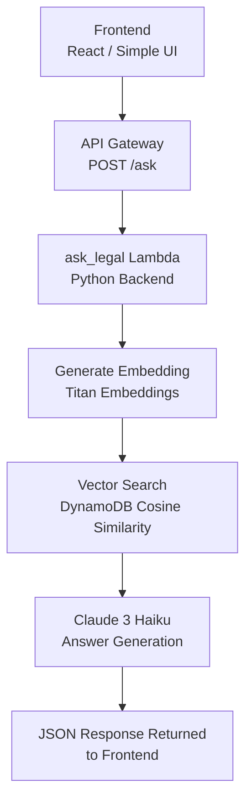

# PYTHon-AI-for-Bharat

## Tech Stack

### Backend

### AWS Services

### Frontend

### Tools

## 🏗 System Architecture

```mermaid
flowchart TD

A[Frontend<br>React / Simple UI] --> B[API Gateway<br>POST /ask]

B --> C[ask_legal Lambda<br>Python Backend]

C --> D[Generate Embedding<br>Titan Embeddings]

D --> E[Vector Search<br>DynamoDB Cosine Similarity]

E --> F[Claude 3 Haiku<br>Answer Generation]

F --> G[JSON Response Returned<br>to Frontend]
```