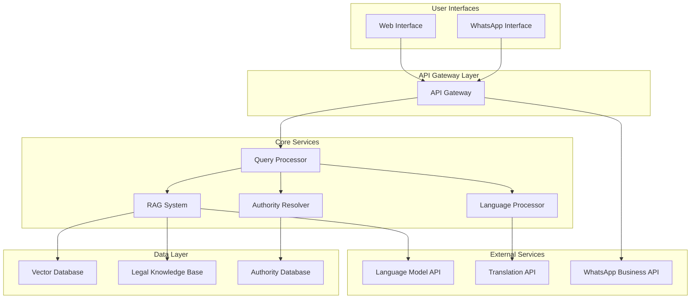

# Design Document: AI Legal Awareness Assistant

## Overview

The AI Legal Awareness Assistant is a conversational system that provides Indian citizens with accessible legal information through WhatsApp and web interfaces. The system uses Retrieval-Augmented Generation (RAG) to deliver accurate, contextual legal guidance in multiple Indian languages while maintaining clear boundaries between legal awareness and legal advice.

The architecture follows a microservices approach with distinct components for query processing, knowledge retrieval, language processing, and multi-channel communication. The system prioritizes user privacy, response accuracy, and accessibility for citizens with varying levels of digital literacy.

## Architecture

The system employs a layered architecture with the following key components:



The architecture ensures scalability through horizontal scaling of stateless services, with caching layers for frequently accessed legal content and authority information.

## Components and Interfaces

### Query Processor Service

**Purpose**: Central orchestration service that coordinates query handling, classification, and response generation.

**Key Interfaces**:
- `POST /api/v1/query` - Process user queries
- `GET /api/v1/query/{id}/status` - Check query processing status
- `POST /api/v1/query/classify` - Classify query by legal domain

**Core Functions**:
- Query sanitization and privacy protection
- Legal domain classification (family law, property, employment, consumer rights, etc.)
- Response orchestration from multiple services
- Context management for multi-turn conversations

### Language Processor Service

**Purpose**: Handles multi-language support, translation, and localization for Indian languages.

**Key Interfaces**:
- `POST /api/v1/language/detect` - Detect input language
- `POST /api/v1/language/translate` - Translate text between supported languages
- `POST /api/v1/language/localize` - Localize legal terms and concepts

**Supported Languages**:
- Primary: Hindi, English
- Secondary: Bengali, Tamil, Telugu, Marathi, Gujarati
- Integration with IndicTrans2 for high-quality Indic language translation

### RAG System Service

**Purpose**: Retrieval-Augmented Generation system for accessing and contextualizing legal knowledge.

**Key Interfaces**:
- `POST /api/v1/rag/retrieve` - Retrieve relevant legal documents
- `POST /api/v1/rag/generate` - Generate contextual responses
- `POST /api/v1/rag/update` - Update knowledge base content

**Core Components**:
- Vector embeddings using sentence-transformers optimized for legal text
- FAISS vector database for efficient similarity search
- Legal document chunking with context preservation
- Response generation with source attribution

### Authority Resolver Service

**Purpose**: Identifies relevant government authorities and provides contact information and procedures.

**Key Interfaces**:
- `POST /api/v1/authority/resolve` - Find relevant authorities for legal issues
- `GET /api/v1/authority/{id}` - Get detailed authority information
- `POST /api/v1/authority/procedure` - Get step-by-step procedures

**Authority Database Schema**:
- Authority metadata (name, jurisdiction, contact details)
- Procedure templates for common legal processes
- Hierarchical authority relationships (local, state, central)

### WhatsApp Interface Service

**Purpose**: Manages WhatsApp Business API integration for conversational interactions.

**Key Interfaces**:
- `POST /webhook/whatsapp` - Receive WhatsApp messages
- `POST /api/v1/whatsapp/send` - Send messages via WhatsApp
- `GET /api/v1/whatsapp/status` - Check message delivery status

**Message Handling**:
- Text message processing with context preservation
- Voice message transcription using speech-to-text
- Image processing for document analysis (future enhancement)
- Rich media responses with formatted legal information

## Data Models

### Query Model
```typescript
interface LegalQuery {
  id: string;
  userId: string; // anonymized identifier
  content: string;
  language: string;
  classification: LegalDomain[];
  timestamp: Date;
  context?: ConversationContext;
  metadata: QueryMetadata;
}

interface ConversationContext {
  previousQueries: string[];
  userPreferences: UserPreferences;
  sessionId: string;
}
```

### Legal Knowledge Model
```typescript
interface LegalDocument {
  id: string;
  title: string;
  content: string;
  source: DocumentSource;
  jurisdiction: Jurisdiction;
  lastUpdated: Date;
  tags: string[];
  embedding: number[];
}

interface DocumentSource {
  type: 'constitution' | 'act' | 'rule' | 'guideline' | 'judgment';
  authority: string;
  url?: string;
  reliability: number;
}
```

### Authority Model
```typescript
interface Authority {
  id: string;
  name: string;
  type: AuthorityType;
  jurisdiction: Jurisdiction;
  contactInfo: ContactInfo;
  procedures: Procedure[];
  operatingHours: OperatingHours;
}

interface Procedure {
  id: string;
  name: string;
  steps: ProcedureStep[];
  requiredDocuments: string[];
  estimatedTime: string;
  fees?: string;
}
```

### Response Model
```typescript
interface LegalResponse {
  id: string;
  queryId: string;
  content: string;
  language: string;
  sources: DocumentSource[];
  authorities?: Authority[];
  disclaimers: string[];
  confidence: number;
  generatedAt: Date;
}
```

## Correctness Properties

*A property is a characteristic or behavior that should hold true across all valid executions of a system—essentially, a formal statement about what the system should do. Properties serve as the bridge between human-readable specifications and machine-verifiable correctness guarantees.*

Based on the prework analysis, the following properties validate the system's correctness:

**Property 1: Legal Information Relevance**
*For any* legal query submitted by a user, the Legal_Awareness_Assistant should provide responses that contain relevant information about applicable rights and laws based on current Indian legal sources.
**Validates: Requirements 1.1, 1.4**

**Property 2: Simple Language Usage**
*For any* legal response generated by the system, the text should use simple, non-technical language with appropriate readability metrics for ordinary citizens.
**Validates: Requirements 1.2**

**Property 3: Multi-Domain Response Organization**
*For any* query involving multiple legal areas, the response should be organized by relevant legal domains with clear section separation.
**Validates: Requirements 1.3**

**Property 4: Comprehensive Disclaimer Inclusion**
*For any* legal response, the system should include both awareness-only disclaimers and AI limitation disclaimers to distinguish from legal advice.
**Validates: Requirements 1.5, 7.2**

**Property 5: Multi-Language Processing**
*For any* query submitted in Hindi or other supported regional languages, the Language_Processor should successfully process and understand the query content.
**Validates: Requirements 2.1**

**Property 6: Language Consistency and Quality**
*For any* user query, the response should be provided in the same language as the query while maintaining meaning and context of legal terms through high-quality translation.
**Validates: Requirements 2.2, 2.4**

**Property 7: Unsupported Language Handling**
*For any* query submitted in an unsupported language, the system should inform the user about the limitation and offer to respond in a supported language.
**Validates: Requirements 2.5**

**Property 8: Authority Identification**
*For any* query requiring government intervention, the system should identify and recommend the relevant authority or department.
**Validates: Requirements 3.1**

**Property 9: Complete Authority Information**
*For any* authority recommendation, the response should include available contact details, office locations, operating hours, and step-by-step procedural guidance.
**Validates: Requirements 3.2, 3.4**

**Property 10: Authority Prioritization**
*For any* query with multiple relevant authorities, the system should prioritize them by jurisdiction and relevance in the response ordering.
**Validates: Requirements 3.3**

**Property 11: Information Limitation Transparency**
*For any* response where authority information is outdated or unavailable, the system should explicitly acknowledge these limitations.
**Validates: Requirements 3.5**

**Property 12: WhatsApp Message Processing**
*For any* message sent to the WhatsApp interface, the system should successfully receive, process, and handle text, voice messages, and images.
**Validates: Requirements 4.1, 4.2**

**Property 13: Mobile-Optimized Response Formatting**
*For any* response sent via WhatsApp, the formatting should be appropriate for mobile viewing with proper line breaks and structure.
**Validates: Requirements 4.3**

**Property 14: Conversation Context Preservation**
*For any* multi-turn conversation, the WhatsApp interface should maintain relevant context across message exchanges.
**Validates: Requirements 4.4**

**Property 15: System Unavailability Error Handling**
*For any* system unavailability scenario, the WhatsApp interface should provide appropriate error messages and retry instructions.
**Validates: Requirements 4.5**

**Property 16: Query Classification**
*For any* user query, the Query_Classifier should categorize it by appropriate legal domain (family law, property, employment, etc.).
**Validates: Requirements 5.1**

**Property 17: Ambiguous Query Clarification**
*For any* ambiguous query, the system should ask clarifying questions to better understand the user's needs.
**Validates: Requirements 5.2**

**Property 18: Out-of-Scope Query Handling**
*For any* query outside the system's scope, the response should clearly explain limitations and suggest alternative resources.
**Validates: Requirements 5.3**

**Property 19: Common Legal Scenario Coverage**
*For any* common legal scenario faced by ordinary citizens, the Query_Classifier should successfully handle and process the query.
**Validates: Requirements 5.4**

**Property 20: User Privacy Protection**
*For any* query processing, the system should maintain user privacy by not storing personal identifying information and anonymizing personal details before analysis.
**Validates: Requirements 5.5, 9.1, 9.2**

**Property 21: Legal Knowledge Base Comprehensiveness**
*For any* major Indian legal domain or procedure, the RAG_System should maintain relevant information in its knowledge base.
**Validates: Requirements 6.1**

**Property 22: Knowledge Base Update Support**
*For any* legal information change, the RAG_System should support proper updates that are reflected in subsequent retrievals.
**Validates: Requirements 6.2**

**Property 23: Semantic Search Relevance**
*For any* user query, the RAG_System should retrieve information that is semantically relevant using vector similarity search.
**Validates: Requirements 6.3**

**Property 24: Content Prioritization**
*For any* information retrieval, the RAG_System should prioritize the most current and applicable legal content in the ranking.
**Validates: Requirements 6.4**

**Property 25: Source Attribution Tracking**
*For any* response generated, the RAG_System should track and include information about which sources were used to enable verification.
**Validates: Requirements 6.5**

**Property 26: Legal Advice Boundary Maintenance**
*For any* response provided, the system should clearly distinguish between general legal awareness and specific legal advice, avoiding information that could be construed as case-specific advice.
**Validates: Requirements 7.1, 7.4**

**Property 27: Professional Consultation Recommendations**
*For any* situation requiring immediate legal intervention, the system should recommend consulting with qualified legal professionals.
**Validates: Requirements 7.3**

**Property 28: Uncertainty Acknowledgment**
*For any* response where information accuracy is uncertain, the system should acknowledge limitations and suggest verification with authorities.
**Validates: Requirements 7.5**

**Property 29: High Load Queue Management**
*For any* high system load scenario, the system should queue requests and provide estimated response times to users.
**Validates: Requirements 8.3**

**Property 30: Maintenance Notification**
*For any* required system maintenance, the system should provide advance notice to users.
**Validates: Requirements 8.5**

**Property 31: Data Security and Retention**
*For any* conversation logs maintained, the system should encrypt sensitive data and enforce appropriate retention period limits.
**Validates: Requirements 9.4**

**Property 32: Data Practice Transparency**
*For any* user request about data handling practices, the system should provide clear information about privacy and data processing policies.
**Validates: Requirements 9.5**

<function_calls>
<invoke name="prework">
<parameter name="featureName">ai-legal-awareness-assistant

## Error Handling

The system implements comprehensive error handling across all components to ensure graceful degradation and user-friendly error messages:

### Query Processing Errors
- **Invalid Input**: Sanitize and validate all user inputs, rejecting malicious content while providing helpful feedback
- **Language Detection Failures**: Default to English processing with notification to user about language detection issues
- **Classification Failures**: Route unclassifiable queries to general legal information with clarification requests

### RAG System Errors
- **Knowledge Base Unavailability**: Implement fallback to cached responses and notify users of potential information staleness
- **Vector Search Failures**: Gracefully degrade to keyword-based search with reduced confidence scores
- **LLM API Failures**: Implement retry logic with exponential backoff and fallback to pre-generated responses

### WhatsApp Integration Errors
- **API Rate Limiting**: Implement request queuing with user notification of delays
- **Message Delivery Failures**: Retry failed messages and provide delivery status updates
- **Webhook Failures**: Implement dead letter queues for failed webhook processing

### Authority Resolution Errors
- **Outdated Authority Information**: Display clear warnings about information currency and suggest verification
- **Missing Contact Details**: Provide alternative contact methods and escalation paths
- **Jurisdiction Ambiguity**: Present multiple relevant authorities with explanations of their roles

### Privacy and Security Errors
- **PII Detection Failures**: Implement conservative anonymization with manual review flags
- **Encryption Failures**: Fail securely by rejecting data storage rather than storing unencrypted data
- **Access Control Violations**: Log security events and implement automatic account suspension

## Testing Strategy

The testing approach combines unit testing for specific scenarios with property-based testing for comprehensive validation of system behaviors.

### Unit Testing Approach
Unit tests focus on specific examples, edge cases, and integration points:

- **Query Processing**: Test specific legal query examples, edge cases with malformed input, and integration between components
- **Language Processing**: Test specific translation examples, edge cases with mixed languages, and fallback scenarios
- **Authority Resolution**: Test specific authority lookup scenarios, edge cases with ambiguous jurisdictions
- **WhatsApp Integration**: Test specific message formats, error conditions, and webhook processing
- **Privacy Protection**: Test specific PII detection scenarios and anonymization edge cases

### Property-Based Testing Configuration
Property tests validate universal behaviors across all inputs using **fast-check** (JavaScript) with minimum 100 iterations per test:

- Each property test references its corresponding design document property
- Test tag format: **Feature: ai-legal-awareness-assistant, Property {number}: {property_text}**
- Properties cover core system behaviors like language consistency, privacy protection, and response quality
- Generators create realistic legal queries, multi-language inputs, and various user scenarios
- Shrinking helps identify minimal failing cases for debugging

### Integration Testing
- **End-to-End Workflows**: Test complete user journeys from query submission to response delivery
- **Multi-Service Integration**: Validate interactions between Query Processor, RAG System, and Language Processor
- **External API Integration**: Test WhatsApp API, translation services, and LLM API integrations
- **Database Integration**: Validate vector database operations and knowledge base updates

### Performance Testing
- **Load Testing**: Validate system performance under concurrent user loads
- **Response Time Testing**: Ensure 30-second response time requirement under normal conditions
- **Memory Usage Testing**: Monitor memory consumption during large document processing
- **Scalability Testing**: Validate horizontal scaling of stateless services

### Security Testing
- **Privacy Validation**: Verify PII anonymization and data retention policies
- **Input Sanitization**: Test against injection attacks and malicious input
- **Access Control**: Validate API authentication and authorization mechanisms
- **Data Encryption**: Verify encryption of sensitive data in transit and at rest

The dual testing approach ensures both specific correctness (unit tests) and general system properties (property tests), providing comprehensive coverage for a system handling sensitive legal information.